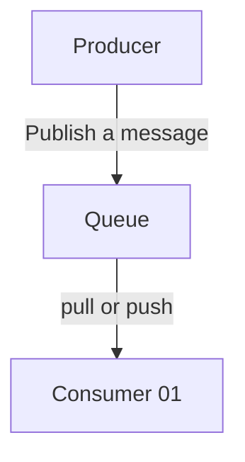
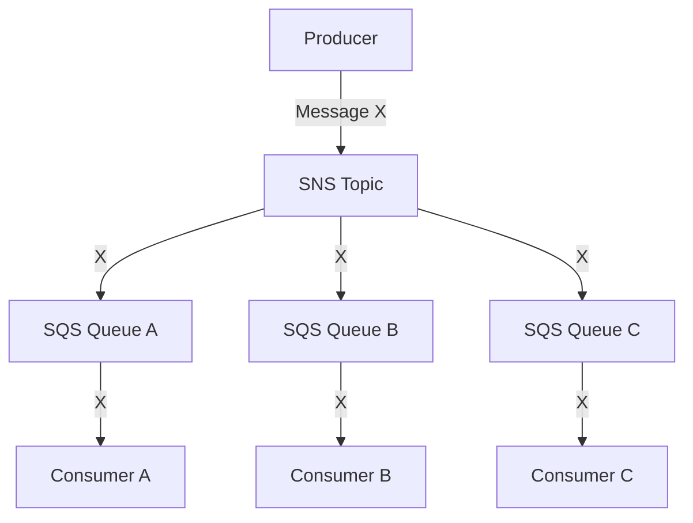

# :mantelpiece_clock: Queuing Systems Deep Dive [WIP] :mantelpiece_clock:

TODOS

- [ ] Expand each section :x:
- [ ] Add discriptive visuals :x:

## Overview

Learn the differences between message queues and brokers, and how popular tools like SQS, RabbitMQ, and Bull handle retries, ordering, deduplication, and more — with examples and visuals.

---

## Queue vs Broker

| Term       | Description                                                                                |
| ---------- | ------------------------------------------------------------------------------------------ |
| **Queue**  | A data structure that stores messages, usually FIFO.                                       |
| **Broker** | A system that manages routing, delivery, and storage of messages using one or more queues. |

**Example:**

- **SQS** is a **queue** (managed by AWS).
- **RabbitMQ** is a **broker** (manages multiple queues).

---

## Push vs Pull

**Pull-Based Systems** (SQS, Bull, Kafka)

- Consumers explicitly fetch messages.

```js
// SQS example
sqs.receiveMessage({
  QueueUrl: 'url',
  MaxNumberOfMessages: 5,
})
```

**Push-Based Systems** (RabbitMQ, SNS)

- Messages are delivered to consumers automatically (via TCP or HTTP).

```js
// RabbitMQ example
channel.prefetch(3)
channel.consume('queue_name', (msg) => {
  // process msg
})
```

---

## Message Distribution

**Queue Pattern (Point-to-Point)** (SQS/RabbitMQ)

- One message → one consumer



> **You cannot have multiple consumers pull the exact same message from a single queue.**
>
> - Messages in an SQS/RabbitMQ queue are consumed by one consumer only.
> - Once a message is received (and deleted), it’s gone.
> - Even if you have multiple consumers, each one gets a different message (load balanced).

**Pub/Sub Pattern (Fan-out)** (RabbitMQ or SQS/SQS combo)

- One message → all subscribers



> :brain: Each queue gets its own copy of the message → each consumer group receives and processes it independently.
>
> :point_up: If you thought the first diragram in this section is a sub diagram of the second one, then you are 100% right.

---

## Truths about Queues (SQS / RabbitMQ single queue behavior)

- :x: You cannot have multiple consumers pull (or be pushed) the exact same message from a single queue.
- Messages in a single SQS or RabbitMQ queue are delivered to one consumer only.
- If multiple consumers are attached to the same queue, the broker/load balancer distributes messages among them — one message per consumer.
- Once a message is acknowledged or deleted, it's removed from the queue.
- It won’t be seen by others unless it fails and is requeued (or not acknowledged in time).
- With multiple consumers on a single queue, messages are load balanced — each consumer processes a different message.

---

## Retries

**SQS**

- Automatic retry via Visibility Timeout
- Use Dead Letter Queues (DLQ) after `maxReceiveCount`

**RabbitMQ**

- Manual retry with TTL and Dead Letter Exchanges (DLX)

```js
channel.nack(msg, false, false) // reject & don't requeue
```

---

## Message Ordering

| System       | Support                                                |
| ------------ | ------------------------------------------------------ |
| **SQS**      | FIFO queues (strict order via `MessageGroupId`)        |
| **RabbitMQ** | FIFO per queue; not guaranteed with multiple consumers |

---

## Deduplication

| System       | Built-in?                                                              |
| ------------ | ---------------------------------------------------------------------- |
| **SQS**      | :heavy_check_mark: FIFO queues auto-deduplicate within 5-minute window |
| **RabbitMQ** | :x: Manual only (e.g., via Redis, DB, or plugin)                       |

---

## Controlling Message Load

**SQS**

```js
MaxNumberOfMessages: 10 // per receive call
```

**Bull**

```js
queue.process(5, async (job) => {
  // handle up to 5 jobs in parallel
})
```

**RabbitMQ**

```js
channel.prefetch(3) // allow only 3 unacked messages
```

---

## Message Lifecycle: When Are Messages Removed?

### **SQS**

- Message is hidden during **Visibility Timeout**.
- Message is **only removed** when the consumer calls:

```js
sqs.deleteMessage({ ReceiptHandle: '...' })
```

- If not deleted, message becomes visible again → retried.
- After `maxReceiveCount`, it's sent to a DLQ (if configured).

### **RabbitMQ**

- Message is **pushed to consumer** and waits for ack.
- Message is **only removed** when consumer calls:

```js
channel.ack(msg)
```

- If not acked (e.g., consumer crashes or `nack` called), it's requeued or dead-lettered.

---

## Summary Comparison

| Feature         | SQS                    | RabbitMQ                     |
| --------------- | ---------------------- | ---------------------------- |
| Type            | Managed Queue          | Message Broker               |
| Order           | FIFO supported         | FIFO in queue only           |
| Retry           | Automatic + DLQ        | Manual + DLX                 |
| Deduplication   | Built-in (FIFO only)   | Manual                       |
| Scaling         | Easy (AWS handles it)  | You scale broker + consumers |
| Message Removal | Call `deleteMessage()` | Call `ack()`                 |
